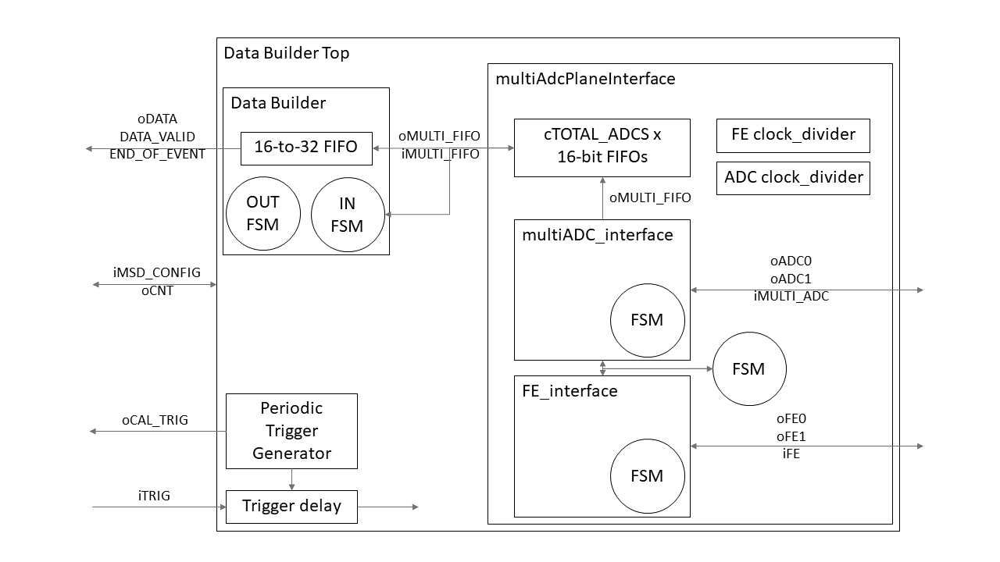

This repository contains the FPGA gateware to readout the microstrip detector of the FOOT experiment. It is based on the Terasic DE10-Nano board, which embeds an Intel Cyclone V SoC (FPGA+HPS). This should limit the use with Intel FPGA only for specific basic elements, e.g. FIFOs.

# Architecture

- **Data_Builder_Top.vhd**: wrapper that instantiates *Data_Builder.vhd*, *multiAdcPlaneInterface.vhd*, and ancillary tools.
- **multiAdcPlaneInterface.vhd**: interface to a X-Y plane. It instantiates and synchronizes *multiADC_interface.vhd* and *FE_interface.vhd* and it includes a FIFO for each ADC.
- **FE_interface.vhd**: interface to the IDEAS 1140 Front-Ends.
- **multiADC_interface.vhd**: interface to the ADCs. Samples the incoming signals in a 16-bit shift-register.
- **Data_Builder.vhd**: collects the ADC FIFOs data into a bigger FIFO, moving from 16-bit to 32-bit words. It also implements the output interface to the FOOT DAQ.

In the folder *basic_functions* there are some basic tools (counters, shift-registers, ...) that are used in the other modules.

The gateware is organized in packages to group parameters, types declarations, and components declarations. In particular, there are two packages:

- **FOOTpackage.vhd**: Main package.
- **basic_functions/basic_package.vhd**: Package containing basic functions and tools.

# Specifications for the FE-ADC sequencer

1. The system shall react to an **external trigger**
2. The system shall produce an **internal periodic trigger** for calibration purposes
    - The frequency of this trigger shall be settable via a register
3. Both triggers shall be delayed before reaching the actual interface modules
    - The delay shall be settable via a configuration register
4. During the whole readout operation, the system shall assert a **busy line** to the central DAQ
5. A detector board (hybrid) represents one half plane. In each hybrid there are:
    - 1x 640-channel microstrip detector
    - 10x FEs grouped in 5 subsets of 2 FEs each, connected in a daisy-chain
6. An ADC board reads out two hybrids, to form an X-Y plane.
    - 10x ADCs digitize the 20x FE outputs
        - 1x ADC is connected to a group of 2x FEs

Front-Ends and ADCs models:

- FE: IDEAS IDE1140, 64-channel silicon-strip readout with analog mux output
- ADC: Analog Devices AD7276, 3-Msps 12-Bit ADC with serial digital readout

---
Once a trigger occurs, the sequencer shall perform the following steps:

7. **Assert the hold** line of the FEs
8. **Forward the clock** to the FEs and to the ADCs
    - The FEs will shift their analog output into the ADCs
9. **Collect the digital output** from the ADCs
10. ADCs and FEs should have **synchronous clocks**
    - Variable frequency, settable by two registers
    - FEs should have a clock divider greater than ADCs by a factor 18, at least
11. The clock of the FE shall have a duty-cycle lower than 50%, in order to avoid ringing at the sampling

---
*Desiderata:*

1.	[] Compression algorithm
    -	There is the AMS one that may be implemented in FPGA
